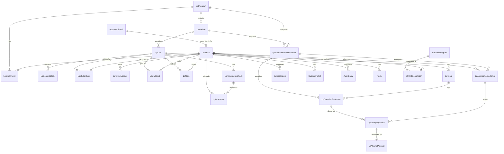

# How the Platform's Database Is Designed

**Date:** 2026-09-14
**Purpose:** Explain how student/course/support data is stored and organized. Written for the team generally — some technical terms are used, but explained as they come up.

---

## 1. The big picture

Cloud Heroes Africa has two apps today: **Student Hub** (login, dashboard, profile, help/support) and **Learning Platform** (courses, quizzes, assessments).

Until recently, each app kept its own data in plain JSON files on disk — no real database, just structured text files read and written directly. That's fine for a quick prototype, but it doesn't hold up in production: nothing enforces that the data is well-formed, two processes writing at once can corrupt a file, and there's no efficient way to query across records.

**Both apps have now been migrated onto one shared Postgres database**, accessed through **Prisma** (an ORM — a toolkit that lets the app's code read/write the database using typed function calls instead of hand-written SQL, and that also manages "migrations," i.e. versioned, ordered changes to the database's structure over time).

---

## 2. How the schema is organized

The database's structure ("schema") is split across three files, each owning a distinct set of tables:

- **`lp-core.prisma`** — the ~20 tables that belong to Learning Platform: course content, progress, tokens, assessments. **Learning Platform is the only app that applies schema changes (migrations) to the database.**
- **A shared "platform-core" file** — 4 tables used by both apps: `Student`, `ApprovedEmail`, `SupportTicket`, `AuditEntry`.
- **A "student-hub-local" file** — 4 tables that are conceptually Student Hub's own, but still live in the same database: `Todo`, `Event`, plus Student Hub's own simplified course catalog (`ShMockProgram`, `ShUnitCompletion`).

Both apps' copies of the shared/local files are kept identical by a small sync script that runs before Prisma generates its client code — so there's one source of truth for those 8 tables' definitions, not two hand-maintained copies that could drift apart.

---

## 3. What's stored, table by table

**Identity**
- `Student` — one row per student: name, email, country, timezone, active program, MFA/passkey data, security status. This is the single shared master record — both apps read the same row.
- `ApprovedEmail` — the sign-in allow-list (approved / revoked / pending).

**Course content** — `LpProgram → LpModule → LpUnit → LpContentBlock`
- A strict three-level hierarchy: Program contains Modules, a Module contains Units, a Unit contains ordered content blocks (text, image, code, video, etc.). No level below Unit — that was deliberately simplified in August (an earlier "Section" layer was removed).
- Each `LpUnit` has a `tokensAward` (tokens given for completing it) and `tokensRequired` (tokens needed to unlock it) — this is how course progression is gated.

**Progress**
- `LpEnrollment` — which program a student is enrolled in.
- `LpStudentUnit` — per-student, per-unit status: `in_progress / completed / retake / verified`.
- `LpTokenLedger` — an append-only running history of every token award (not just a single running total), so the balance is always reconstructable and can't silently drift.
- `LpUnitGoal`, `LpNote` — a student's self-set deadlines and free-text notes per unit.

**Testing & assessment** — the most fully built-out part of the schema
- `LpKnowledgeCheck` — a short quiz tied to one Unit.
- `LpStandaloneAssessment` + `LpQuestionBankItem` — bigger module/program-level tests: a bank of tagged, difficulty-rated questions (`easy/medium/difficult`), randomly selected per attempt.
- `LpAssessmentAttempt` + `LpAttemptQuestion` + `LpAttemptAnswer` — a full record of every attempt: which questions it drew, what was answered, when, whether it was submitted or expired, and a cooldown timestamp before the next retake is allowed.
- `LpEscalation` — created automatically after repeated Knowledge Check or Assessment failures, so a staff member gets flagged to follow up.

**Support**
- `SupportTicket` — Help Desk / Service Desk requests, with a status (`open/pending/responded/resolved/cancelled`) and a running status-change log kept on the record itself.
- `AuditEntry` — an append-only security log of sensitive account changes (profile edits, MFA changes): who did it, what changed, when.

**Student Hub extras**
- `Todo`, `Event` — dashboard to-dos and calendar events.
- `ShMockProgram`, `ShUnitCompletion` — Student Hub's own simplified course catalog, kept separate from Learning Platform's real one (reconciling the two catalogs is a known, separate piece of future work).

---

## 4. Diagram: tables and how they connect

Boxes are tables; a line means one table points at another (a "foreign key" — a row in one table referencing the id of a row in another). `||` means "exactly one," `o{` means "zero or more" — so `STUDENT ||--o{ LP_ENROLLMENT` reads as "one Student has zero or more Enrollments."

A few things this diagram makes visible at a glance:
- **`Student` is the hub of the whole database** — almost every other table points back to a student, because almost everything (progress, tokens, tickets, audit history) is fundamentally "a thing that happened to one student."
- **The content hierarchy (`LpProgram → LpModule → LpUnit`) is a strict single chain**, not a tree with extra branches — reflecting the deliberate decision to keep courses exactly three levels deep.
- **The assessment engine is the most connected corner of the diagram** — a Standalone Assessment can belong to either a Module or a Program, draws from a shared Question Bank, and every attempt is tracked question-by-question, which is what allows retakes to be freshly randomized while still preserving an exact historical record of every past attempt.
- **`Event` has no line into it** — events are shared seed/admin content that isn't tied to an individual student.

---

## 5. How two apps share one database without conflicting

Sharing one database across two independently-deployed apps only works if it's clear **which app is allowed to write to what** — otherwise you get silent data conflicts. The rules in place:

- **`Student` has one authoritative writer: Student Hub.** Learning Platform can read the table directly, but if it needs to create or update a student record (e.g. on first login), it calls an API on Student Hub instead of writing to the row itself. This closed a real bug where both apps used to independently create/update the same student record with no coordination.
- **Learning Platform is the sole migration runner** — even for the 8 tables that are shared or "belong" to Student Hub. Two apps both running schema migrations against one database risks corrupting Postgres's own migration bookkeeping, so by convention only one app is allowed to change the database's structure. Student Hub only ever reads/writes rows in those tables, never changes their shape.
- **`SupportTicket` has one real read/manage engine: Student Hub.** Learning Platform can only create a new ticket row (write-once) — it has no ticket list/status-management logic of its own, since it doesn't have a support-desk UI.

None of this is meant to be permanent — it's a stand-in until a dedicated "Administration" app exists, at which point ownership of `ApprovedEmail`/`SupportTicket`/`AuditEntry` will likely move there.

---

## 6. How the old data got into the new database

- A one-time migration script moved every record out of the old JSON files (students, approved emails, tickets, audit log, todos, events, and Student Hub's mock catalog) into the new Postgres tables, in dependency order (people first, then anything that references a person).
- It's written to be safely re-runnable — it updates existing rows by their known ID rather than duplicating them if run again.
- The original JSON files are still sitting in the repo as a safety net; they're no longer the "live" copy of anything and are scheduled for cleanup once the migration is fully verified.

---

## 7. Open questions worth a team decision

- **Is Postgres/Prisma the final home for assessment data specifically?** A late-August decision confirmed the assessment tables should be *logically* separate from Student Hub's data (linked only by student ID, which is already how it's built), but explicitly left open whether the underlying engine stays Postgres or moves to something else entirely. Right now, everything — assessments included — runs on the one shared Postgres database.
- **The "Postgres vs. a NoSQL alternative" decision is still marked `Open`** in the team's decision log, even though every other document and all the actual implementation already treat Postgres as final. Worth a quick formal close-out entry so it stops reading as unresolved.
- **Who owns the Help Desk tables long-term?** Student Hub is currently standing in for an "Administration" app that doesn't exist yet — worth confirming whether that's meant to be permanent or just until Administration gets built.
