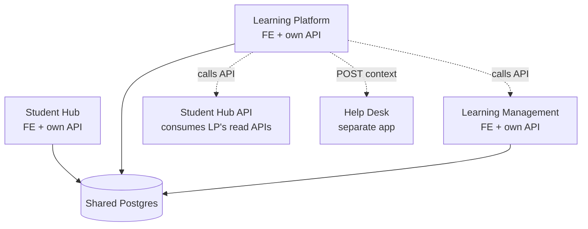
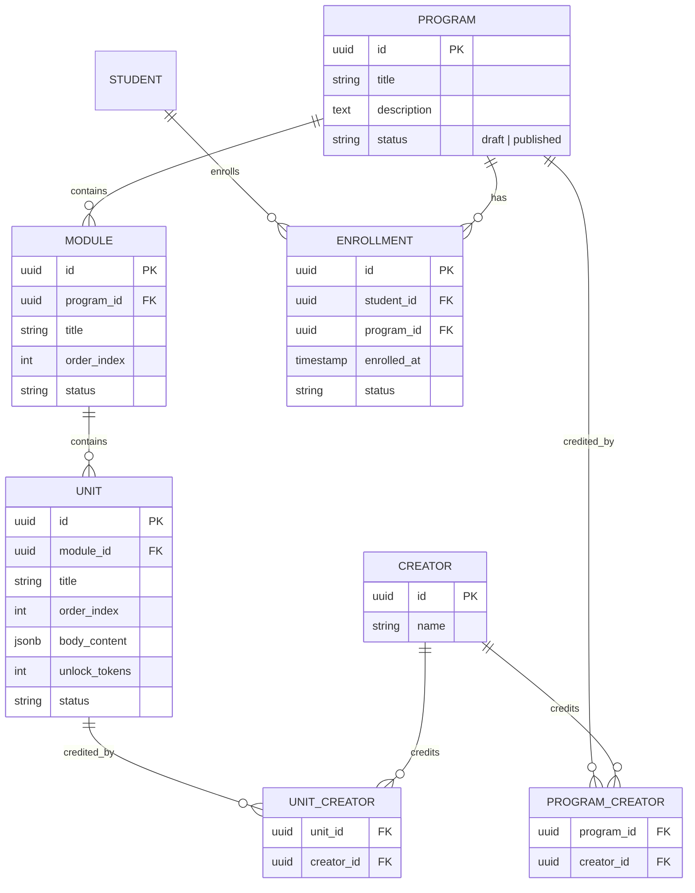
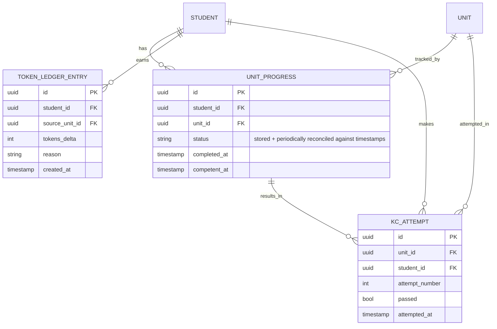
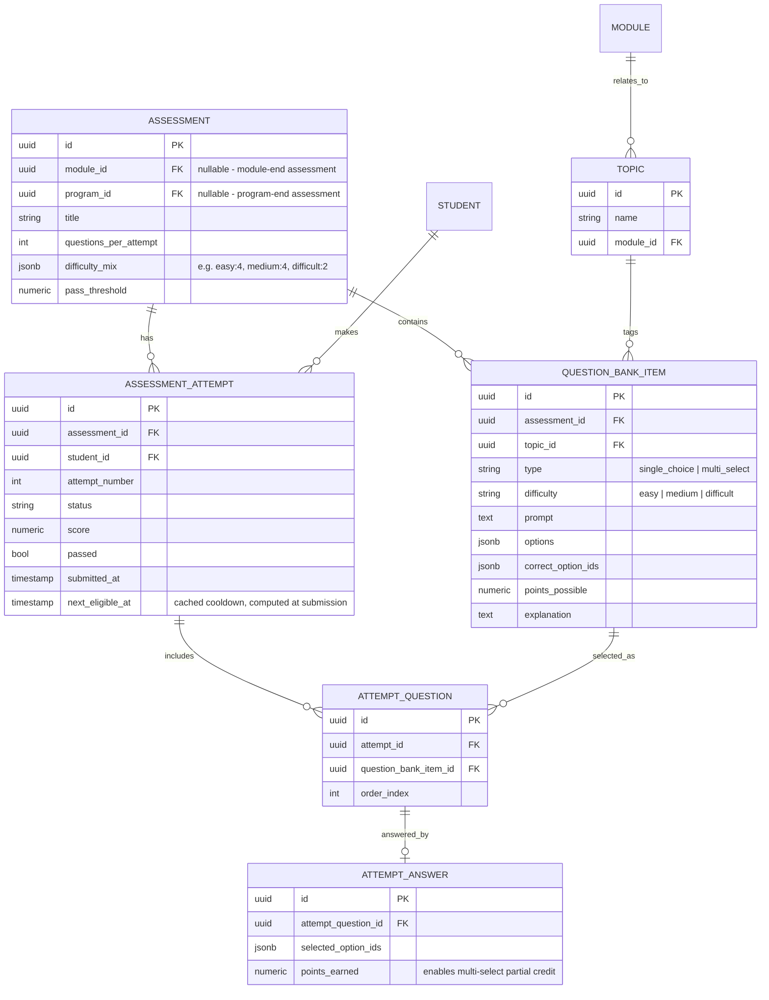
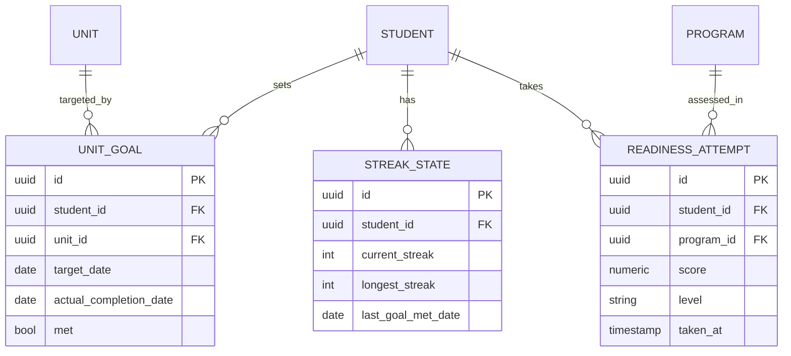

# Learning Platform — System Design (Draft v1)

> Status: Draft, produced collaboratively by Bichesq + Claude, 2026-08-10. Not yet ratified by the team — see "Open Items" and "Decisions Made This Session" before treating anything here as final.

---

## 1. Scope & Constraints

- Surface: **Learning Platform (LP)** only — the student-facing content/assessment delivery app, separate from Student Hub, Learning Management, Administration, and Donor Hub.
- Scale target: **100–1,000 students**, mostly self-paced, traffic spread through the day (not cohort-bursty).
- Priority: balanced (not pure demo speed, not pure long-term robustness).
- Database: **Postgres**, confirmed (treating the 2026-07-13 decision as authoritative over the still-open 2026-07-09 NoSQL question — see Open Items).
- Terminology: the progression currency is called **tokens**, not points, throughout the schema and product copy.

---

## 2. Architecture Overview

### 2.1 Shared platform pattern

Each app surface (Student Hub, Learning Platform, Learning Management, Administration, Donor Hub) owns **its own backend API service**, but all services share **one Postgres database**. No surface reads another surface's tables directly — cross-surface data access always goes through the owning surface's API. This preserves independent deployability while keeping one consistent data model, per the team's existing "shared data store + multiple front-ends" decision (2026-06-04).

### 2.2 Learning Platform internal structure

LP is built as a **single modular monolith** (not split into microservices) — deliberately, after weighing it: splitting out even just the assessment engine would introduce cross-service transactions for a workflow (grade → award tokens → update unit status → check for repeated failure) that's naturally atomic in one service. With 100–1,000 self-paced students, there's no scaling pressure that justifies paying that complexity cost.

Internal modules, each with clean table ownership (no cross-module table reads outside their own boundary):

| Module | Responsibility |
|---|---|
| `content` | Programs/modules/units, creator credits, enrollment (see 2.3) |
| `knowledge-checks` | In-unit quizzes, pass/fail, retake-reset flow |
| `assessments` | Standalone assessments, question bank cache, randomization, scoring, cooldowns |
| `progress` | Unit Completed/Competent status, token ledger, unlock thresholds |
| `goals` | Deadlines, streak calculation |
| `readiness` | Exam readiness scores |
| `help-context` | Context snapshot + call-out to Help Desk |

### 2.3 Enrollment — flagged dependency

"List enrolled programs" requires knowing which students are enrolled in which programs. Conceptually this is a student-management concern (Administration), but Administration is explicitly out of POC/V1 scope per the 2026-06-04 decision log entry. **Resolution for now:** LP owns a thin `ENROLLMENT` table (`student_id`, `program_id`, `enrolled_at`, `status`), deliberately decoupled from the rest of LP's schema so it can be migrated to Administration later without touching anything else. **This should be logged as a team decision — see section 6.**

---

## 3. Data Model

### 3.1 Content structure

Notes:
- `status` fields (draft/published) exist so Learning Management authors can edit without exposing unfinished content to students.
- `unlock_tokens` lives on the unit itself — simplest model for the token-gating rule; would need rework if unlock rules ever get more complex (e.g. per-track thresholds).
- Creators modeled as explicit many-to-many join tables (not a polymorphic table) for referential integrity.

### 3.2 Progress & tokens

Notes:
- **Tokens are an append-only ledger**, not a mutable counter on the student row — gives an audit trail ("why does this student have 340 tokens?"), avoids race conditions on concurrent updates, and supports a future "token history" UI. Current balance = sum of entries (cache a balance column if read performance ever demands it).
- **`UNIT_PROGRESS.status` is stored but periodically reconciled** against `completed_at`/`competent_at`/attempt history — either via a scheduled job or (preferably) a DB trigger that recomputes it whenever the underlying timestamps/attempts change, catching drift structurally rather than relying on a cron job to notice after the fact.
- `KC_ATTEMPT` history is what makes the "2nd failure → notify a team member" rule queryable.

### 3.3 Standalone assessments

Notes:
- **`ASSESSMENT` and `QUESTION_BANK_ITEM` are a cache of what Learning Management published**, not LP's source of truth — LM owns assessment *authoring* per existing decisions; LP's assessment engine needs fast, frequent local queries for randomization, so it maintains a synced copy (see §4 caching strategy).
- **`ATTEMPT_QUESTION` snapshots which specific questions were selected for a specific attempt** — this is what makes retakes get freshly-randomized questions while preserving an exact historical record for review/audit.
- **`ATTEMPT_ANSWER.points_earned` is numeric, not boolean** — this is where multi-select partial credit is actually computed and stored. "No correctness shown during attempt" is enforced at the API layer (don't return `correct_option_ids`/`points_earned` until after submission).
- **`TOPIC` added specifically to support weak-area feedback** (a gap not covered in the original requirements) — links questions to a skill area *and* back to the module that teaches it, so post-assessment feedback can say "review Module 3: Loops," not just "you missed the hard questions."
- `next_eligible_at` cached on the attempt row at submission time, same store-and-reconcile pattern as unit status.

### 3.4 Goals, streaks, and readiness

Notes:
- `STREAK_STATE` is a cached summary row (avoids recomputing from full `UNIT_GOAL` history on every dashboard load); `UNIT_GOAL` retains the raw history so the cache can always be recomputed/validated.
- `READINESS_ATTEMPT` is append-only; "latest score" = most recent row, "trend" = full history query.

---

## 4. API Contracts

**LP consumes from Learning Management** (server-to-server; results cached locally in LP with a TTL, refreshed on poll or manual trigger — no webhook for V1, since content changes infrequently and building reliable webhook delivery isn't worth it yet):
- `GET /programs/{id}?status=published` → nested module/unit structure
- `GET /assessments/{id}` → assessment definition + full question bank (including correct answers — safe, server-to-server only, never sent to the browser)

**LP exposes to Student Hub** (read-only, powers dashboard widgets):
- `GET /students/{id}/programs/summary` → current unit, progress %, courses remaining
- `GET /students/{id}/assessments/status` → pass/fail summary
- `GET /students/{id}/goals/streak` → current + longest streak
- `GET /students/{id}/readiness` → latest score + trend per program
- `GET /students/{id}/resume` → `{program_id, module_id, unit_id}` — powers the "Start learning" handshake

**LP calls out to Help Desk**: `POST /help-tickets` `{student_id, program_id, module_id, unit_id, message}`

All calls ride the shared auth session established at login — no separate credentials between surfaces.

---

## 5. Reliability & Scale

**Scale:** not a V1 concern. 100–1,000 self-paced students spread through the day is well within what a single Postgres instance and a single backend instance handle without any special engineering. Explicitly deferred: read replicas, sharding, autoscaling tuning, load balancer sophistication.

**Reliability baseline (scale-independent — worth doing regardless of user count):**
1. Automated Postgres backups + point-in-time recovery (managed-service checkbox, not custom engineering).
2. Idempotent writes on critical paths — e.g., a unique constraint preventing a retried "submit assessment attempt" request from double-inserting a token ledger entry or double-counting a pass.
3. Graceful degradation when Learning Management is unreachable — LP serves last-cached content rather than erroring, since the TTL cache already exists for this reason.

Explicitly deferred as optional, not required for V1: Multi-AZ/failover, elaborate monitoring/alerting infrastructure, rate-limiting infrastructure.

---

## 6. Decisions Made This Session (candidates to add to `decision-log.md`)

| Date | Area | Decision | Status | Owner | Reason / Notes |
|---|---|---|---|---|---|
| 2026-08-10 | LP backend architecture | Learning Platform is a single modular monolith, not split into microservices; internal module boundaries enforced at the table-ownership level | Decided (pending team ratification) | Bichesq | Avoids cross-service transactions for atomic workflows (grade → tokens → unit status → escalation) at a scale that doesn't need independent service scaling |
| 2026-08-10 | Cross-surface data access | Surfaces never read each other's Postgres tables directly, even though they share one DB — all cross-surface reads go through the owning surface's API | Decided (pending team ratification) | Bichesq | Preserves the independent-deployability rationale behind the per-surface API decision |
| 2026-08-10 | Enrollment ownership (interim) | LP owns a thin `enrollment` table (student_id, program_id, enrolled_at, status) until Administration exists, kept decoupled for future migration | Decided (pending team ratification) | Bichesq | Administration is out of POC scope but LP's core catalog view requires enrollment data now |
| 2026-08-10 | Terminology | Progression currency renamed from "points" to "tokens" across schema and product copy | Decided | Bichesq | — |
| 2026-08-10 | Learning Management content sync | LP caches published content/assessments from Learning Management via polling/TTL + manual refresh, not webhooks, for V1 | Decided (pending team ratification) | Bichesq | Content changes infrequently; webhook delivery reliability isn't worth building yet |
| 2026-08-10 | Assessment weak-area feedback | Added a `TOPIC` entity (linked to `module_id`) to question bank items to support meaningful weak-area feedback | Decided (pending team ratification) | Bichesq | Original requirements called for weak-area feedback but had no mechanism to identify a question's subject area |

---

## 7. Open Items — Needs Team Discussion

1. **Enrollment/Administration scope conflict**: LP's "list enrolled programs" requirement depends on data that, per the POC scope decision, lives in a module (Administration) not being built yet. The interim fix (§2.3) works but should be explicitly ratified, not just assumed.
2. **Postgres vs. NoSQL**: this design treats Postgres as settled (per 2026-07-13), but the decision log's Open Decisions table still lists the 2026-07-09 NoSQL question as unresolved. Worth a formal close-out so it doesn't resurface mid-build.
3. Everything already flagged as Open in the existing decision log that touches LP (badges/gamification scope, assignment submission workflow, placement assessment location, advanced student bypass mechanism) still applies — this design leaves extension points for them but doesn't resolve them.